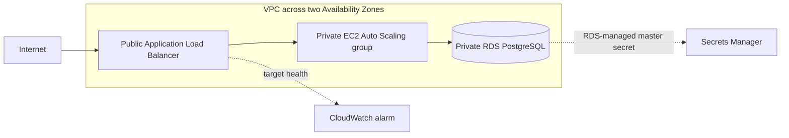

<div align="center">


**A three-tier AWS architecture focused on one question: _what should be allowed to talk to what?_**

[](https://github.com/yourclouddude)
[](https://yourclouddude.com/)

</div>

---

## What this project teaches

A three-tier architecture is easy to draw. The useful engineering is in the **network and trust boundaries** between the tiers.

```text
Internet → Application Load Balancer → private EC2 Auto Scaling group → private RDS PostgreSQL
```

This project deliberately keeps those boundaries explicit:

- the internet can reach only the ALB on port 80
- the ALB can reach the application tier on port 8080
- the application tier can reach PostgreSQL on port 5432
- EC2 instances have no public IP addresses
- RDS is not publicly accessible
- there is no SSH ingress rule
- the base stack has no NAT gateway

## Architecture



| Tier | Exposure | Allowed path |
|---|---|---|
| Load balancer | Public | Internet → ALB :80 |
| Application | Private | ALB → EC2 :8080 |
| Database | Private | EC2 → RDS :5432 |

The network module creates separate public, application, and database subnets across two Availability Zones. Only the ALB occupies public subnets.

## Why there is no NAT gateway

Many three-tier diagrams add a NAT gateway automatically. This stack does not.

The demo application uses Python already available on the Amazon Linux 2023 AMI, so the EC2 instances do not need package downloads during boot. Removing NAT keeps the architecture easier to reason about and avoids a meaningful hourly/data-processing cost.

The trade-off is real: private instances cannot reach public package repositories or public AWS endpoints by default. If the design later needs Systems Manager, external APIs, package installation, or other outbound dependencies, add deliberate VPC endpoints or egress and document why.

## What runs on EC2?

The launch template starts a small Python HTTP service on port `8080`.

The `/health` endpoint checks whether the web process itself is alive. The main page separately attempts a TCP connection to the RDS endpoint and reports whether the database network path is reachable.

Those checks are intentionally different. A temporary database problem should not automatically make the load balancer treat a healthy web process as dead.

The demo does **not** authenticate to PostgreSQL. RDS manages the master password in Secrets Manager, and the credential is not copied into user data or source code.

## Security boundaries worth noticing

- no public IPs on EC2 instances
- no security group opens port 22
- only the ALB has internet-wide ingress
- ALB egress is limited to the application security group on port 8080
- application egress is limited to PostgreSQL plus VPC DNS
- RDS accepts PostgreSQL only from the application security group
- EC2 root volumes and RDS storage are encrypted
- IMDSv2 is required by the launch template
- the RDS master password is AWS-managed

Terraform state can still contain sensitive infrastructure data. Do not commit state files. Shared environments should use a protected remote backend.

## Repository layout

```text
.
├── .github/workflows/terraform.yml
├── docs/
│   ├── architecture.md
│   └── troubleshooting.md
├── modules/
│   ├── database/
│   ├── network/
│   └── web/
├── scripts/
│   └── security_guardrails.sh
├── backend.tf.example
├── main.tf
├── outputs.tf
├── security.tf
├── terraform.tfvars.example
├── variables.tf
└── versions.tf
```

## Before you apply

You need:

- Terraform 1.7+
- an AWS account and credentials you control
- permission to create the VPC, EC2, Auto Scaling, ELBv2, RDS, Secrets Manager-managed RDS credentials, security-group, and CloudWatch resources

This stack creates **billable AWS resources**. The ALB, EC2 instances, RDS instance/storage, CloudWatch alarm, and managed database secret are the main items to review.

Start from the example variables:

```bash
cp terraform.tfvars.example terraform.tfvars
```

Then:

```bash
terraform init
terraform fmt -check -recursive
terraform validate
terraform plan
terraform apply
```

After apply, Terraform outputs the ALB URL. The page displays the responding EC2 hostname and whether the RDS network path is reachable.

## What CI checks

GitHub Actions runs:

```bash
terraform fmt -check -recursive
terraform init -backend=false
terraform validate
bash scripts/security_guardrails.sh
```

The repository-specific guardrail script checks assumptions this project cares about, including:

- no public EC2 IPs
- no public RDS
- no SSH ingress
- exactly one internet-wide security-group rule
- IMDSv2 enforcement
- encrypted RDS storage
- AWS-managed database credentials

It is a focused project guardrail—not a complete security audit.

## Experiments that change the design

### Break the ALB → application path

Change the application ingress rule and watch the target group become unhealthy. The security-group dependency becomes immediately visible.

### Break the application → database path

Change the PostgreSQL path. The ALB can still report healthy web targets while the page reports the database network path as unavailable.

### Add real database access

Give the EC2 application a narrowly scoped IAM role, read the RDS-managed secret at runtime, and make a SQL query without copying credentials into user data or the repository.

### Add controlled private-instance management

Compare NAT egress with Systems Manager VPC endpoints and document the operational and cost trade-offs.

### Add HTTPS

Introduce ACM and a 443 listener, then decide what should happen to port 80.

## What the base stack deliberately leaves out

This is not presented as a complete production platform. The base version does not include:

- Multi-AZ RDS
- HTTPS or a custom domain
- WAF
- preconfigured remote Terraform state
- application-level SQL authentication
- SSM access to private instances
- centralized application logs
- a tested disaster-recovery strategy

Those omissions are part of the learning surface. Add them when you can explain the new dependency, cost, failure mode, and permission boundary they introduce.

## Questions you should be able to answer

- Why are the EC2 instances private?
- Why does the ALB need a different security group from the application tier?
- Why is there no NAT gateway in the base design?
- Why should application health and database reachability be separate checks?
- What changes when private instances need outbound internet access?
- Where should database credentials live?
- What would you change first for a production-facing workload?

## Cleanup

```bash
terraform destroy
```

Review the destruction plan before approving it. The learning configuration intentionally uses `skip_final_snapshot = true` and no deletion protection so the stack can be removed cleanly. That is a learning-environment choice, not a production retention policy.

For deeper reasoning, see [`docs/architecture.md`](docs/architecture.md). Common failure modes are covered in [`docs/troubleshooting.md`](docs/troubleshooting.md).

---

<div align="center">

### YourCloudDude

**Build the architecture. Break a boundary. Explain what changed.**

[](https://yourclouddude.com/)


</div>