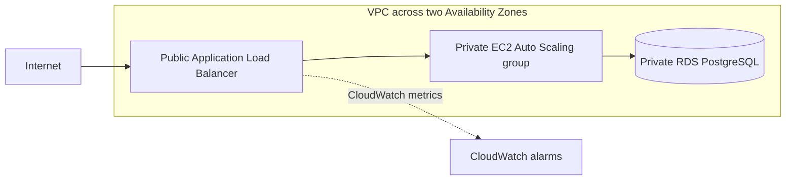

# Terraform AWS Three-Tier Web Stack

This project is about one question: **what should be allowed to talk to what?**

The stack builds a small AWS web architecture with Terraform:

```text
Internet -> Application Load Balancer -> private EC2 Auto Scaling group -> private RDS PostgreSQL
```

The interesting part is not the number of AWS services. It is the network boundary between each tier.

- The internet can reach the ALB on port 80.
- The ALB can reach the application instances on port 8080.
- The application instances can reach PostgreSQL on port 5432.
- The EC2 instances have no public IP addresses.
- RDS is not publicly accessible.
- There is no SSH ingress rule.
- The base stack has no NAT gateway, so the private application tier does not quietly depend on internet egress.

The repository uses the **YourCloudDude** brand only and is intended as a learner-first infrastructure project.

## Architecture



The network module creates separate public, application, and database subnets across two Availability Zones. Only the ALB uses the public subnets. The EC2 and RDS tiers stay in private subnets with no default route to the internet.

## Why no NAT gateway?

A common three-tier diagram adds a NAT gateway automatically. This project does not.

The demo application uses only Python that is already available on the Amazon Linux 2023 AMI, so the instances do not need to download packages during boot. Removing NAT keeps the base architecture easier to reason about and avoids a meaningful hourly/data-processing cost.

That choice has a trade-off: private instances also cannot reach public package repositories or public AWS service endpoints. If you later add Systems Manager, external APIs, package installation, or other outbound dependencies, add the required VPC endpoints or a deliberate egress path and document why it exists.

## What runs on EC2?

The launch template starts a tiny Python HTTP service on port `8080`.

The `/health` endpoint checks whether the web process itself is alive. The main page separately attempts a TCP connection to the RDS endpoint and reports whether the database network path is reachable.

Those are deliberately different checks. A temporary database problem should not make the load balancer immediately treat a healthy web process as dead.

The demo does **not** authenticate to PostgreSQL. That is intentional: putting database credentials in EC2 user data would be a bad shortcut. A useful next step is to add AWS Secrets Manager or another deliberate secret-delivery design, then make the application perform a real SQL query.

## Security boundaries worth noticing

The Terraform code is intentionally restrictive:

- EC2 instances receive no public IP addresses.
- No security group opens port 22.
- ALB ingress is the only `0.0.0.0/0` rule in the Terraform configuration.
- ALB egress is limited to the application security group on port 8080.
- application egress is limited to PostgreSQL plus VPC DNS.
- RDS accepts PostgreSQL traffic only from the application security group.
- RDS storage and EC2 root volumes are encrypted.
- the launch template requires IMDSv2.
- the database password is a sensitive Terraform variable and is never stored in this repository.

Terraform state can still contain sensitive values. Do not commit state files. For shared environments, configure a protected remote backend before applying the stack.

## Repository layout

```text
.
├── .github/workflows/terraform.yml
├── docs/
│   ├── architecture.md
│   └── troubleshooting.md
├── modules/
│   ├── database/
│   ├── network/
│   └── web/
├── scripts/
│   └── security_guardrails.sh
├── main.tf
├── outputs.tf
├── security.tf
├── terraform.tfvars.example
├── variables.tf
└── versions.tf
```

## Before you apply

You need:

- Terraform 1.7+
- an AWS account and credentials you control
- permission to create VPC, EC2, Auto Scaling, ELBv2, RDS, security-group, and CloudWatch resources

This stack creates **billable resources**. The ALB, EC2 instances, and RDS instance are the main things to watch. There is no NAT gateway in the base design, but that does not make the stack free.

Start with the example variables:

```bash
cp terraform.tfvars.example terraform.tfvars
```

Set the database password through your shell rather than writing it into the committed example file:

```bash
export TF_VAR_db_password='use-a-long-unique-password-here'
```

Then run:

```bash
terraform init
terraform fmt -check -recursive
terraform validate
terraform plan
terraform apply
```

After apply, Terraform prints the ALB URL. Open it in a browser. The page should show the hostname of the responding EC2 instance and whether the RDS network path is reachable.

## What CI checks

GitHub Actions runs:

```bash
terraform fmt -check -recursive
terraform init -backend=false
terraform validate
bash scripts/security_guardrails.sh
```

The repository-specific guardrail script checks the assumptions this project cares about: no public EC2 IPs, no public RDS, no SSH ingress, exactly one internet-wide CIDR rule, IMDSv2 enforcement, and encrypted RDS storage.

It is intentionally not described as a complete security audit.

## A few experiments that actually change the design

**Break the ALB-to-app rule.** Remove or change the application ingress rule and watch the target group become unhealthy. This makes the security-group dependency visible.

**Break the app-to-database rule.** Change the PostgreSQL security-group path. The ALB can still report healthy web targets while the page reports that the database network path is unavailable.

**Add real database access.** Introduce secret delivery and a SQL client without placing credentials in user data, source code, or Git-tracked variable files.

**Add controlled private-instance management.** Compare NAT egress with Systems Manager VPC endpoints and document the cost and operational difference.

**Add HTTPS.** Introduce ACM and a 443 listener, then decide what should happen to port 80.

## What this project does not claim

This is not presented as a complete production platform. In particular, the base version does not include:

- Multi-AZ RDS
- HTTPS or a custom domain
- WAF
- remote Terraform state configured for you
- Secrets Manager integration
- application-level SQL authentication
- SSM access to the private instances
- centralized application logs
- a tested disaster-recovery strategy

Those omissions are part of the learning surface. Add them when you can explain the new dependency, cost, failure mode, and permission boundary they introduce.

## Cleanup

When you are finished:

```bash
terraform destroy
```

Review the plan before approving destruction. The learning configuration uses an RDS setup that is easy to destroy and does not pretend to be a production data-retention policy.

For deeper reasoning, see [`docs/architecture.md`](docs/architecture.md) once the implementation files are in place. Common failure modes live in [`docs/troubleshooting.md`](docs/troubleshooting.md).

## YourCloudDude

Practical AWS, cloud, and Python projects for developers who learn by building.

**Website:** https://yourclouddude.com/
